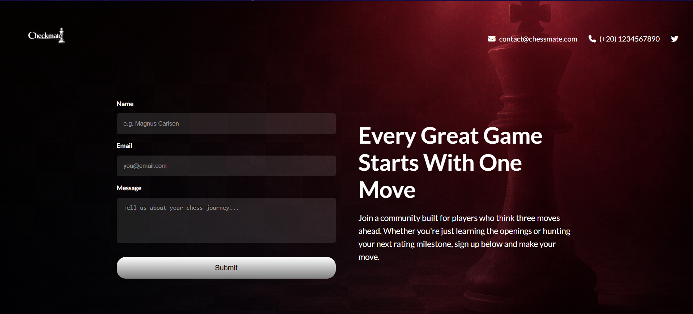

# ♜ Chessmate

A dark-themed chess community signup page — built as an HTML & CSS practice project.

## Preview

🔗 **[View Live Demo](https://mostafamohammedatef.github.io/checkmate/)**

## Features

- Responsive layout (mobile-friendly)
- CSS-only form validation styling
- Custom hover and focus states
- Google Fonts + Font Awesome icons

## Built With

- HTML5
- CSS3 (Flexbox, media queries)

## Run Locally

Clone the repo and open `index.html` in your browser — no build step needed.

\`\`\`bash
git clone https://github.com/MostafaMohammedAtef/checkmate.git
\`\`\`
